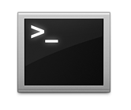

# Framework-tool


_**Display infomations of frameworks for Mac**_

## Requirements


#### Platform

- \> Mac OS X 10.8 &emsp;&emsp;(tested on 10.9.3)
  
#### Dependency

- \> Ruby 1.9
- \> open3 (gem)

#### License

- MIT Lisence

## Install

#### Install on the fly

```
curl https://raw.githubusercontent.com/atmarksharp/framework-tool/master/install.sh | sh
```

#### Update 

```
curl https://raw.githubusercontent.com/atmarksharp/framework-tool/master/update.sh | sh
```

#### Uninstall 

```
curl https://raw.githubusercontent.com/atmarksharp/framework-tool/master/uninstall.sh | sh
```

## Usage



#### Command line

> **framework-tool** &emsp; *[framework]* &emsp; *[file]* &emsp; *[-?lshcifmao]*

#### Parameters

- **-help** | -?
<br>&emsp;&emsp; show help (this page)

- **-list** | -l
<br>&emsp;&emsp; print all frameworks

- **-search** | -s
<br>&emsp;&emsp; search *[framework]*

- **-header** | -h
<br>&emsp;&emsp; show header-files of *[framework]*

- **-contents** | -c
<br>&emsp;&emsp; print contents of *[file]* with *[framework]*

- **-includes** | -i
<br>&emsp;&emsp; print includes of *[file]* with *[framework]*

- **-fields** | -f
<br>&emsp;&emsp; print fields of *[file]* with *[framework]*

- **-module** | -m
<br>&emsp;&emsp; print module.map of *[framework]*

- **-allheader** | -a
<br>&emsp;&emsp; show all headers

- **-open** | -o
<br>&emsp;&emsp; open *[file]* in *[framework]*

## Examples

### Show help

- command

```
framework-tool -help
```

- output

```
  -help | -?   ........  show help (this page)
  -list | -l   ........  print all frameworks
  -search | -s  .......  search [framework]

  			  ex)  framework-tool "Audio" -search
  			 -------------------------------------

  -header | -h  .......  show header-files of [framework]

  			  ex)  framework-tool "AudioUnit" -h
  			 ------------------------------------

  -contents | -c ......  print contents of [file] with [framework]

  			  ex)  framework-tool "AudioUnit" "AUComponent" -c
  			 --------------------------------------------------

  -includes | -i ......  print includes of [file] with [framework]
  -fields | -f  .......  print fields of [file] with [framework]
  -module | -m  .......  print module.map of [framework]

  			  ex)  framework-tool "AudioUnit" -module
  			 -----------------------------------------

  -allheader | -a  .......  show all headers

  			  ex)  framework-tool -a
  			 ------------------------

  -open | -o  .......  open [file] in [framework]

  			  ex)  framework-tool "AudioUnit" "AUComponent" -open
  			 -----------------------------------------------------


```

### Show framework list

- command

```
framework-tool -list
```

- output

```
[Frameworks]

AGL
AVFoundation
AVKit
Accelerate
Accounts
AddressBook
AppKit
AppKitScripting
AppleScriptKit
AppleScriptObjC
AppleShareClientCore
ApplicationServices
AudioToolbox
AudioUnit
AudioVideoBridging
Automator
CFNetwork
CalendarStore
Carbon
Cocoa
Collaboration
CoreAudio
CoreAudioKit
CoreData
CoreFoundation
CoreGraphics
CoreLocation
CoreMIDI
CoreMIDIServer
CoreMedia
CoreMediaIO
CoreServices
CoreText
CoreVideo
CoreWLAN
CoreWiFi
DVComponentGlue
DVDPlayback
DirectoryService
DiscRecording
DiscRecordingUI
DiskArbitration
DrawSprocket
EventKit
ExceptionHandling
FWAUserLib
ForceFeedback
Foundation
GLKit
GLUT
GSS
GameController
GameKit
ICADevices
IMCore
IMServicePlugIn
IOBluetooth
IOBluetoothUI
IOKit
IOSurface
ImageCaptureCore
ImageIO
InputMethodKit
InstallerPlugins
InstantMessage
JavaFrameEmbedding
JavaScriptCore
JavaVM
Kerberos
Kernel
LDAP
LatentSemanticMapping
MapKit
MediaAccessibility
MediaLibrary
MediaToolbox
Message
NetFS
OSAKit
OpenAL
OpenCL
OpenDirectory
OpenGL
PCSC
PreferencePanes
PubSub
Python
QTKit
Quartz
QuartzCore
QuickLook
QuickTime
Ruby
RubyCocoa
SceneKit
ScreenSaver
Scripting
ScriptingBridge
Security
SecurityFoundation
SecurityInterface
ServiceManagement
Social
SpriteKit
StoreKit
SyncServices
System
SystemConfiguration
TWAIN
Tcl
Tk
VideoDecodeAcceleration
VideoToolbox
WebKit
vecLib
```

### Get header-files of "OpenGL"

- command

```
framework-tool "OpenGL" -h
```

- output

```
[Headers of "OpenGL"]

CGLContext
CGLCurrent
CGLDevice
CGLIOSurface
CGLMacro
CGLRenderers
CGLTypes
OpenGL
OpenGLAvailability
gl
gl3
gl3ext
glext
gliContext
gliDispatch
gltypes
glu
gluContext
gluMacro
```

### Show includes of "OpenGL/gl.h"

- command 

```
framework-tool "OpenGL" "gl" -i
```

- output

```
[Includes of "OpenGL/gl.h"]

OpenGL/gltypes
OpenGL/glext
```

### Show fields of "OpenGL/gl.h"

- command

```
framework-tool "OpenGL" "gl" -fields
```

- output

```
[Fields of "OpenGL/gl.h"]

access	/^typedef GLvoid *(* glMapBufferProcPtr) (GLenum tar/
alpha	/^typedef void (* glBlendColorProcPtr) (GLclampf red/
array	/^typedef void (* glDisableClientStateProcPtr) (GLen/
base	/^typedef void (* glListBaseProcPtr) (GLuint base);$/
bitmap	/^typedef void (* glBitmapProcPtr) (GLsizei width, G/
blue	/^typedef void (* glColor3bProcPtr) (GLbyte red, GLb/
border	/^typedef void (* glCopyTexImage1DProcPtr) (GLenum t/
buffer	/^typedef void (* glFeedbackBufferProcPtr) (GLsizei /
buffers	/^typedef void (* glDeleteBuffersProcPtr) (GLsizei n/
bufs	/^typedef void (* glDrawBuffersProcPtr) (GLsizei n, /
c	/^typedef void (* glClearIndexProcPtr) (GLfloat c);$/
cap	/^typedef void (* glDisableProcPtr) (GLenum cap);$/
column	/^typedef void (* glSeparableFilter2DProcPtr) (GLenu/
coord	/^typedef void (* glFogCoordfProcPtr) (GLfloat coord/
count	/^typedef void (* glDrawArraysProcPtr) (GLenum mode,/
data	/^typedef void (* glColorSubTableProcPtr) (GLenum ta/
depth	/^typedef void (* glClearDepthProcPtr) (GLclampd dep/
dfactor	/^typedef void (* glBlendFuncProcPtr) (GLenum sfacto/
dstAlpha	/^typedef void (* glBlendFuncSeparateProcPtr) (GLenu/
equation	/^typedef void (* glClipPlaneProcPtr) (GLenum plane,/
flag	/^typedef void (* glDepthMaskProcPtr) (GLboolean fla/
func	/^typedef void (* glDepthFuncProcPtr) (GLenum func);/
height	/^typedef void (* glCopyConvolutionFilter2DProcPtr) /
i	/^typedef void (* glArrayElementProcPtr) (GLint i);$/
i2	/^typedef void (* glEvalMesh1ProcPtr) (GLenum mode, /
id	/^typedef GLboolean (* glIsQueryProcPtr) (GLuint id)/
ids	/^typedef void (* glGenQueriesProcPtr) (GLsizei n, G/
image	/^typedef void (* glConvolutionFilter1DProcPtr) (GLe/
img	/^typedef void (* glGetCompressedTexImageProcPtr) (G/
index	/^typedef void (* glEnableVertexAttribArrayProcPtr) /
indices	/^typedef void (* glDrawElementsProcPtr) (GLenum mod/
infoLog	/^typedef void (* glGetShaderInfoLogProcPtr) (GLuint/
invert	/^typedef void (* glSampleCoverageProcPtr) (GLclampf/
j	/^typedef void (* glEvalPoint2ProcPtr) (GLint i, GLi/
j2	/^typedef void (* glEvalMesh2ProcPtr) (GLenum mode, /
length	/^typedef void (* glShaderSourceProcPtr) (GLuint sha/
list	/^typedef void (* glCallListProcPtr) (GLuint list);$/
lists	/^typedef void (* glCallListsProcPtr) (GLsizei n, GL/
m	/^typedef void (* glLoadMatrixdProcPtr) (const GLdou/
mask	/^typedef void (* glClearProcPtr) (GLbitfield mask);/
mode	/^typedef void (* glBeginProcPtr) (GLenum mode);$/
modeAlpha	/^typedef void (* glBlendEquationSeparateProcPtr) (G/
name	/^typedef const GLubyte *(* glGetStringProcPtr) (GLe/
nz	/^typedef void (* glNormal3bProcPtr) (GLbyte nx, GLb/
opcode	/^typedef void (* glLogicOpProcPtr) (GLenum opcode);/
param	/^typedef void (* glFogfProcPtr) (GLenum pname, GLfl/
params	/^typedef void (* glColorTableParameterfvProcPtr) (G/
pattern	/^typedef void (* glLineStippleProcPtr) (GLint facto/
pixels	/^typedef void (* glDrawPixelsProcPtr) (GLsizei widt/
pointer	/^typedef void (* glColorPointerProcPtr) (GLint size/
points	/^typedef void (* glMap1dProcPtr) (GLenum target, GL/
primcount	/^typedef void (* glMultiDrawArraysProcPtr) (GLenum /
priorities	/^typedef void (* glPrioritizeTexturesProcPtr) (GLsi/
program	/^typedef void (* glLinkProgramProcPtr) (GLuint prog/
q	/^typedef void (* glTexCoord4dProcPtr) (GLdouble s, /
r	/^typedef void (* glTexCoord3dProcPtr) (GLdouble s, /
range	/^typedef void (* glDeleteListsProcPtr) (GLuint list/
ref	/^typedef void (* glAlphaFuncProcPtr) (GLenum func, /
residences	/^typedef GLboolean (* glAreTexturesResidentProcPtr)/
s	/^typedef void (* glClearStencilProcPtr) (GLint s);$/
shader	/^typedef void (* glDeleteShaderProcPtr) (GLuint sha/
shaders	/^typedef void (* glGetAttachedShadersProcPtr) (GLui/
sink	/^typedef void (* glHistogramProcPtr) (GLenum target/
size	/^typedef void (* glPointSizeProcPtr) (GLfloat size)/
source	/^typedef void (* glGetShaderSourceProcPtr) (GLuint /
span	/^typedef void (* glGetSeparableFilterProcPtr) (GLen/
t	/^typedef void (* glTexCoord2dProcPtr) (GLdouble s, /
table	/^typedef void (* glColorTableProcPtr) (GLenum targe/
target	/^typedef void (* glResetHistogramProcPtr) (GLenum t/
texture	/^typedef void (* glBindTextureProcPtr) (GLenum targ/
textures	/^typedef void (* glDeleteTexturesProcPtr) (GLsizei /
token	/^typedef void (* glPassThroughProcPtr) (GLfloat tok/
type	/^typedef void (* glCopyPixelsProcPtr) (GLint x, GLi/
u	/^typedef void (* glEvalCoord1dProcPtr) (GLdouble u)/
u2	/^typedef void (* glMapGrid1dProcPtr) (GLint un, GLd/
units	/^typedef void (* glPolygonOffsetProcPtr) (GLfloat f/
usage	/^typedef void (* glBufferDataProcPtr) (GLenum targe/
v	/^typedef void (* glColor3bvProcPtr) (const GLbyte */
v0	/^typedef void (* glUniform1fProcPtr) (GLint locatio/
v1	/^typedef void (* glUniform2fProcPtr) (GLint locatio/
v2	/^typedef void (* glMapGrid2dProcPtr) (GLint un, GLd/
v3	/^typedef void (* glUniform4fProcPtr) (GLint locatio/
value	/^typedef void (* glAccumProcPtr) (GLenum op, GLfloa/
values	/^typedef void (* glGetHistogramProcPtr) (GLenum tar/
void	/^typedef void (* glEndProcPtr) (void);$/
w	/^typedef void (* glRasterPos4dProcPtr) (GLdouble x,/
width	/^typedef void (* glCopyColorSubTableProcPtr) (GLenu/
x	/^typedef void (* glVertexAttrib1dProcPtr) (GLuint i/
y	/^typedef void (* glRasterPos2dProcPtr) (GLdouble x,/
y2	/^typedef void (* glRectdProcPtr) (GLdouble x1, GLdo/
yfactor	/^typedef void (* glPixelZoomProcPtr) (GLfloat xfact/
z	/^typedef void (* glRasterPos3dProcPtr) (GLdouble x,/
zFar	/^typedef void (* glDepthRangeProcPtr) (GLclampd zNe/
zpass	/^typedef void (* glStencilOpProcPtr) (GLenum fail, /
```

### Print all headers

- command

```
framework-tool -allheader
```

- output

```
( 一部省略 )

Foundation	NSPointerArray
Foundation	NSPointerFunctions
Foundation	NSPort
Foundation	NSPortCoder
Foundation	NSPortMessage
Foundation	NSPortNameServer
Foundation	NSPredicate
GLKit	GLKit
GLKit	GLKitBase
GLUT	copy
GLUT	extrude
GLUT	glsmap
GLUT	glsmapint
GLUT	glut
GLUT	glutbitmap
GLUT	glutf90
GLUT	glutstroke
GLUT	gutil
GLUT	intersect
GLUT	port
GLUT	rot
GLUT	segment
GLUT	tube
GLUT	tube_gc
GLUT	vvector
GSS	GSS
GSS	gssapi
GSS	gssapi_apple
GSS	gssapi_krb5
GSS	gssapi_netlogon
GSS	gssapi_ntlm
GSS	gssapi_oid
GSS	gssapi_protos
GSS	gssapi_spnego
GameController	GCController
GameController	GCControllerAxisInput
JavaScriptCore	JSStringRef
JavaScriptCore	JSStringRefCF
JavaScriptCore	JSValue
JavaScriptCore	JSValueRef
JavaScriptCore	JSVirtualMachine
JavaScriptCore	JavaScript
JavaScriptCore	JavaScriptCore
JavaScriptCore	WebKitAvailability
JavaVM	AWTCocoaComponent
JavaVM	JDWP
JavaVM	JDWPCommands
JavaVM	JavaVM
JavaVM	NSJavaConfiguration
JavaVM	NSJavaVirtualMachine
JavaVM	jawt
JavaVM	jawt_md
JavaVM	jdwpTransport
JavaVM	jni
JavaVM	jni_md
JavaVM	jvmti
Kerberos	CredentialsCache
Kerberos	CredentialsCache2
Kerberos	Kerberos
Kerberos	KerberosLogin
Kerberos	com_err
Kerberos	gssapi
Kerberos	gssapi_generic
Kerberos	gssapi_krb5
Kerberos	krb5
Kerberos	locate_plugin
Kerberos	preauth_plugin
Kerberos	profile
Kernel	AssertMacros
Kernel	Availability
Kernel	AvailabilityInternal
Kernel	AvailabilityMacros
Kernel	TargetConditionals
Kernel	architecture
Kernel	mach
Kernel	mach-o
Kernel	mach_debug
Kernel	machine
Kernel	stdarg
Kernel	stdbool
Kernel	stdint
Kernel	string
LDAP	lber
LDAP	ldap
LatentSemanticMapping	LatentSemanticMapping
MapKit	MKAnnotation
MapKit	MKAnnotationView
MapKit	MKCircle
MapKit	MKCircleRenderer
MapKit	MKDirections
MapKit	MKDirectionsRequest
MapKit	MKDirectionsResponse
MapKit	MKDirectionsTypes
MapKit	MKDistanceFormatter
MapKit	MKFoundation
MapKit	MKGeodesicPolyline
MapKit	MKGeometry
MapKit	MKLocalSearch
MapKit	MKLocalSearchRequest
MapKit	MKLocalSearchResponse
Python	opcode
Python	osdefs
Python	parsetok
Python	patchlevel
Python	pgen
Python	pgenheaders
Python	py_curses
Python	pyarena
Python	pycapsule
Python	pyconfig
Python	pyctype
Python	pydebug
Python	pyerrors
Python	pyexpat

WebKit	DOMHTMLOptionsCollection
WebKit	DOMHTMLParagraphElement
WebKit	DOMHTMLParamElement
WebKit	DOMHTMLPreElement
WebKit	DOMHTMLQuoteElement
WebKit	DOMHTMLScriptElement
WebKit	DOMHTMLSelectElement
WebKit	DOMHTMLStyleElement
WebKit	DOMHTMLTableCaptionElement
WebKit	WebKitErrors
WebKit	WebPlugin
WebKit	WebPluginContainer
WebKit	WebPluginViewFactory
WebKit	WebPolicyDelegate
WebKit	WebPreferences
WebKit	WebResource
WebKit	WebResourceLoadDelegate
WebKit	WebScriptObject
WebKit	WebUIDelegate
WebKit	WebView
WebKit	npapi
WebKit	npfunctions
WebKit	npruntime
WebKit	nptypes
vecLib	cblas
vecLib	clapack
vecLib	vBLAS
vecLib	vBasicOps
vecLib	vBigNum
vecLib	vDSP
vecLib	vDSP_translate
vecLib	vForce
vecLib	vecLib
vecLib	vecLibTypes
vecLib	vectorOps
vecLib	vfp
```
